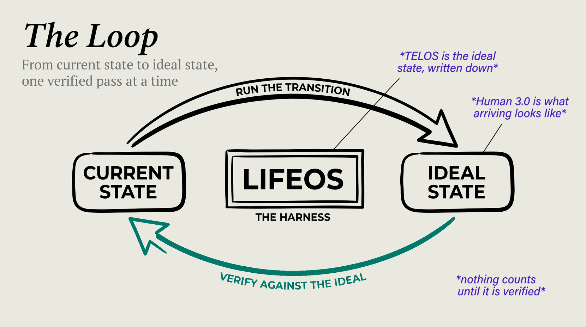

<picture>
  <source media="(prefers-color-scheme: dark)" srcset="images/loop-dark.png">
  
</picture>

&nbsp;
&nbsp;
&nbsp;
&nbsp;

Hi. My name is Daniel Miessler and I'm an AI and cybersecurity researcher and founder in the San Francisco Bay Area. I've been building and writing online since 1999.

Right now I'm excited, but also worried, about humanity's future.

We've been trained for centuries to build our identities around work we don't really care about: our title, our place in a hierarchy, and our usefulness to someone else's company. And now AI is about to let most of those companies bring most knowledge work in-house.

That will be extraordinarily disruptive, but it's also an opportunity, because being a corporate drone was never a peak human experience. So many of us spend our best hours, days, and years dreading Monday and sitting in pointless meetings. It's no way to live, and it never has been.

I'm excited about AI's potential to give people a more meaningful alternative: one based on who they are and what they're trying to achieve.

So that's what I do. I help people (and companies) articulate and pursue their **Ideal State**. That's the loop above. [LifeOS](https://github.com/danielmiessler/LifeOS) runs it for a person, and [Vector](https://ourvector.ai) runs it for a company.

## What I care about

- Using AI to upgrade people, so everyone gets the starting conditions the lucky already have. That's the whole mission, really.
- Security, which I did for a long time and still can't stop thinking about. Once you've watched enough systems fail, you build everything differently.
- Publishing what I think as I think it: around 3,000 essays since 1999 and a weekly show. I think better out loud, and it's the best way I know to find the people who care about the same things.

## What I've built

Everything below is that loop, run on something.

**[LifeOS](https://github.com/danielmiessler/LifeOS)**   
The AI harness that runs the loop: it captures what you ultimately want and carries that intent into every task, then checks the output against it. Formerly PAI.

**[TELOS](https://github.com/danielmiessler/Telos)**   
A framework for writing down deep context about what matters to you, so an AI can actually work toward it.

**[Fabric](https://github.com/danielmiessler/fabric)**   
An open-source framework for augmenting humans using AI, built on crowdsourced prompts for extracting wisdom, analyzing security, summarizing content, and hundreds more.

**[Daemon](https://github.com/danielmiessler/Daemon)**   
A personal API framework from the Universal Daemonization idea in my 2016 book. Mine is live at [daemon.danielmiessler.com](https://daemon.danielmiessler.com).

**[Substrate](https://github.com/danielmiessler/Substrate)**   
A framework for understanding what humans are, what we want, and what progress actually means.

**[TheAlgorithm](https://github.com/danielmiessler/TheAlgorithm)**   
The general problem-solving loop itself, written down: verifiable Ideal State Criteria and the climb toward them.

**[SecLists](https://github.com/danielmiessler/SecLists)**   
The security tester's companion: wordlists and payloads.

<strong>More projects</strong> (earlier and experimental work)

 

| Project | What It Does |
|---------|--------------|
| **[RobotsDisallowed](https://github.com/danielmiessler/RobotsDisallowed)** | The most interesting robots.txt disallowed directories |
| **[Ladder](https://github.com/danielmiessler/Ladder)** | A system for autonomous creation and optimization *(concept, not active)* |
| **[Frames](https://github.com/danielmiessler/Frames)** | Positive and negative mental frames |
| **[ExtractWisdom](https://github.com/danielmiessler/ExtractWisdom)** | The original extract-wisdom prompt project (now in Fabric) |
| **[yt](https://github.com/danielmiessler/yt)** | Pull transcripts from YouTube |
| **[athi](https://github.com/danielmiessler/athi)** | An AI threat modeling framework for policymakers |
| **[Caparser](https://github.com/danielmiessler/Caparser)** | Find apps sending sensitive data unencrypted |

## Idea sites

Each of these is the loop pointed at one question, and a few of them are live systems that keep running on their own.

<table>
<tr>
<td valign="top" width="33%">
<strong><a href="https://samsaid.ai">samsaid.ai</a></strong> 
A neutral archive of what Sam Altman has said  
<strong><a href="https://dariosaid.ai">dariosaid.ai</a></strong> 
A neutral archive of what Dario Amodei has said  
<strong><a href="https://danielsaid.ai">danielsaid.ai</a></strong> 
My own positions, held to the same standard  
<strong><a href="https://eternalquestions.ai">eternalquestions.ai</a></strong> 
The semi-unsolvable questions humanity keeps asking  
<strong><a href="https://therealinternetofthings.ai">therealinternetofthings.ai</a></strong> 
My 2016 book on where IoT was actually headed  
<strong><a href="https://experimentsinfiction.io">experimentsinfiction.io</a></strong> 
A public lab for AI-assisted fiction, with the human share of every story disclosed  
<strong><a href="https://aiharnesses.ai">aiharnesses.ai</a></strong> 
The AI coding harnesses compared: vendor claims and what people actually say
</td>
<td valign="top" width="33%">
<strong><a href="https://shouldwecontrolopensource.ai">shouldwecontrolopensource.ai</a></strong> 
A structured debate on controlling open-source AI  
<strong><a href="https://aiunderstands.ai">aiunderstands.ai</a></strong> 
18 mysteries that test whether AI genuinely understands  
<strong><a href="https://defineitintext.ai">defineitintext.ai</a></strong> 
If you can define the work in text, AI can do it  
<strong><a href="https://thevulnequation.ai">thevulnequation.ai</a></strong> 
Interactive economics of vulnerability discovery  
<strong><a href="https://highentropycontent.io">highentropycontent.io</a></strong> 
Why high-entropy content wins  
<strong><a href="https://oursafe.ai">oursafe.ai</a></strong> 
Secure AI For Everyone, a practical AI-safety taxonomy  
<strong><a href="https://ispalantirtrustworthy.io">ispalantirtrustworthy.io</a></strong> 
An open inquiry into Palantir, with both steelman cases and every source public  
<strong><a href="https://permanentstandardtime.io">permanentstandardtime.io</a></strong> 
The case for permanent Standard Time, with the counter-argument at full strength
</td>
<td valign="top" width="33%">
<strong><a href="https://daemon.danielmiessler.com">daemon.danielmiessler.com</a></strong> 
My live personal daemon: my current state and work as an API  
<strong><a href="https://thesurface.ai">thesurface.ai</a></strong> 
An AI-curated intelligence feed  
<strong><a href="https://usdebt.io">usdebt.io</a></strong> 
The US national debt as living data  
<strong><a href="https://vulnerabilitydata.io">vulnerabilitydata.io</a></strong> 
CVE and patch data as a living dataset  
<strong><a href="https://newarkcacrime.org">newarkcacrime.org</a></strong> 
Civic crime intelligence for my hometown  
<strong><a href="https://usstats.io">usstats.io</a></strong> 
Over 100 US indicators back to the 1970s, straight from primary government data  
<strong><a href="https://bastionengine.io">bastionengine.io</a></strong> 
A deterministic battle-simulation engine with a playable game at <a href="https://bastionengine.io/legion">/legion</a>
</td>
</tr>
</table>

## Writing

The pieces that carry the current thesis:

[From Prompt Engineering to Intent Engineering](https://danielmiessler.com/blog/intent-engineering), [I Think AGI Just Happened](https://danielmiessler.com/blog/i-think-agi-just-happened), [The Three Components of Becoming AI Antifragile](https://danielmiessler.com/blog/becoming-ai-antifragile), [The Coming Divide: AI-Native or Left Behind](https://danielmiessler.com/blog/ai-native-divide), [A Unified Theory For How AI Will Affect Jobs](https://danielmiessler.com/blog/unified-theory-ai-jobs), and [The Most Durable Human Value](https://danielmiessler.com/blog/the-most-durable-human-value).

**Latest posts** (auto-updated daily):

<!-- BLOG-POST-LIST:START -->
- [The Link Between Your Workplace Situation and Your Mental Health](https://danielmiessler.com/blog/workplace-situation-mental-health?utm_source=rss&utm_medium=feed&utm_campaign=website)
- [I Only Do Anything Once](https://danielmiessler.com/blog/i-only-do-anything-once?utm_source=rss&utm_medium=feed&utm_campaign=website)
- [I&#39;m Worried About a Prompt Injection Worm](https://danielmiessler.com/blog/prompt-injection-worm?utm_source=rss&utm_medium=feed&utm_campaign=website)
- [Unconventional Thought Is the Differentiator](https://danielmiessler.com/blog/unconventional-thought-differentiator?utm_source=rss&utm_medium=feed&utm_campaign=website)
- [How to Get Started in Cybersecurity 2026](https://danielmiessler.com/blog/how-to-get-started-in-cybersecurity-2026?utm_source=rss&utm_medium=feed&utm_campaign=website)
- [How AI Builders Will Get Hacked](https://danielmiessler.com/blog/how-ai-builders-get-hacked?utm_source=rss&utm_medium=feed&utm_campaign=website)
- [Fix Execution, Not the SOP](https://danielmiessler.com/blog/fix-execution-not-the-sop?utm_source=rss&utm_medium=feed&utm_campaign=website)<!-- BLOG-POST-LIST:END -->

All 3,000 or so essays are at [danielmiessler.com/blog](https://danielmiessler.com/blog).

## Latest videos

<!-- YOUTUBE-LIST:START -->
- [Should Open-Weight AI Be Regulated? A Conversation with Robert Graham](https://www.youtube.com/watch?v=x7qAPR9E37I)
- [A Conversation With Brandon Dixon](https://www.youtube.com/watch?v=_LByAOxlZi8)
- [The Missing Piece Is Ideal State](https://www.youtube.com/watch?v=z6yBDU7HZA4)
- [A Conversation With Harish Peri](https://www.youtube.com/watch?v=JylyWWPhgFY)
- [Things Are About to Accelerate &lpar;Human 3.0 Preview&rpar;](https://www.youtube.com/watch?v=Uxm4fJxU_HI)<!-- YOUTUBE-LIST:END -->

The show is [Unsupervised Learning on YouTube](https://youtube.com/@unsupervised-learning).

## Connect

[Blog](https://danielmiessler.com), [Newsletter](https://danielmiessler.com/subscribe), [YouTube](https://youtube.com/@unsupervised-learning), [X](https://x.com/danielmiessler), [LinkedIn](https://linkedin.com/in/danielmiessler), [Books](https://unsupervised-learning.com/books), [All repos](https://github.com/danielmiessler?tab=repositories)

