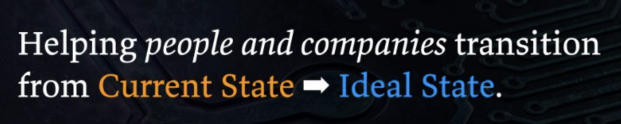

 

**[Building](#what-im-building) ・ [Idea Sites](#idea-sites) ・ [Writing](#writing) ・ [Videos](#latest-videos) ・ [Connect](#connect)**

 

> Most people's current state was assigned to them—a job title, a place in a hierarchy, an identity built on being useful to an organization. AI is about to automate much of that away, and for millions it will feel like losing who they are.
>
> The ideal state is on the other side: knowing who you actually are, what you value, and what you'd pursue even if nobody paid you—with AI handling the routine work so you can do the human work.
>
> **I call that transition [Human 3.0](https://human3.ai). Everything below exists to help people make it.**

 

## What I'm Building

| Project | What It Does | |
|---------|--------------|---|
| **[LifeOS](https://github.com/danielmiessler/LifeOS)** | The AI harness that moves you from your current state to your ideal state—an intent engineering platform that captures what you ultimately want and conveys it to your AI on every task. *(Formerly PAI.)* |  |
| **[Fabric](https://github.com/danielmiessler/fabric)** | An open-source framework for augmenting humans using AI—crowdsourced prompts to extract wisdom, analyze security, summarize content, and hundreds more. |  |
| **[TELOS](https://github.com/danielmiessler/Telos)** | Articulate who you are, what you value, and what you're trying to achieve—structured self-knowledge that AI can actually use to help you. |  |
| **[Substrate](https://github.com/danielmiessler/Substrate)** | The deeper foundation—a framework for understanding what humans are, what we want, and what progress actually means. |  |
| **[TheAlgorithm](https://github.com/danielmiessler/TheAlgorithm)** | A general problem-solving algorithm built on verifiable Ideal State Criteria. |  |
| **[Daemon](https://github.com/danielmiessler/Daemon)** | An open-source personal API framework. |  |
| **[SecLists](https://github.com/danielmiessler/SecLists)** | The security tester's companion—wordlists and payloads. |  |
| **[Human 3.0](https://human3.ai)** | The philosophy—a framework for human flourishing when AI handles the routine work. | |

<strong>More projects</strong> (earlier and experimental work)

 

| Project | What It Does |
|---------|--------------|
| **[RobotsDisallowed](https://github.com/danielmiessler/RobotsDisallowed)** | The most interesting robots.txt disallowed directories |
| **[Ladder](https://github.com/danielmiessler/Ladder)** | A system for autonomous creation and optimization |
| **[Frames](https://github.com/danielmiessler/Frames)** | Positive and negative mental frames |
| **[ExtractWisdom](https://github.com/danielmiessler/ExtractWisdom)** | The original extract-wisdom prompt project (now in Fabric) |
| **[yt](https://github.com/danielmiessler/yt)** | Pull transcripts from YouTube |
| **[athi](https://github.com/danielmiessler/athi)** | An AI threat modeling framework for policymakers |
| **[Caparser](https://github.com/danielmiessler/Caparser)** | Find apps sending sensitive data unencrypted |

 

## Idea Sites

Standalone sites, each making one argument or holding one archive.

**Archives**

| Site | What It Is |
|------|-----------|
| **[samsaid.ai](https://samsaid.ai)** | A neutral archive of what Sam Altman has said |
| **[dariosaid.ai](https://dariosaid.ai)** | A neutral archive of what Dario Amodei has said |
| **[danielsaid.ai](https://danielsaid.ai)** | My own positions, held to the same standard |
| **[eternalquestions.ai](https://eternalquestions.ai)** | The semi-unsolvable questions humanity keeps asking |
| **[therealinternetofthings.ai](https://therealinternetofthings.ai)** | My 2016 book on where IoT was actually headed |

**Arguments**

| Site | What It Is |
|------|-----------|
| **[shouldwecontrolopensource.ai](https://shouldwecontrolopensource.ai)** | A structured debate on controlling open-source AI |
| **[aiunderstands.ai](https://aiunderstands.ai)** | 18 mysteries that test whether AI genuinely understands |
| **[defineitintext.ai](https://defineitintext.ai)** | If you can define the work in text, AI can do it |
| **[thevulnequation.ai](https://thevulnequation.ai)** | Interactive economics of vulnerability discovery |
| **[highentropycontent.io](https://highentropycontent.io)** | Why high-entropy content wins |
| **[oursafe.ai](https://oursafe.ai)** | Secure AI For Everyone—a practical AI-safety taxonomy |

**Live Systems**

| Site | What It Is |
|------|-----------|
| **[thesurface.ai](https://thesurface.ai)** | An AI-curated intelligence feed |
| **[newarkcacrime.org](https://newarkcacrime.org)** | Civic crime intelligence for my hometown |

 

## Writing

Start here—the pieces that carry the current thesis.

[From Prompt Engineering to Intent Engineering](https://danielmiessler.com/blog/intent-engineering) ・ [I Think AGI Just Happened](https://danielmiessler.com/blog/i-think-agi-just-happened) ・ [The Three Components of Becoming AI Antifragile](https://danielmiessler.com/blog/becoming-ai-antifragile) ・ [The Coming Divide: AI-Native or Left Behind](https://danielmiessler.com/blog/ai-native-divide) ・ [A Unified Theory For How AI Will Affect Jobs](https://danielmiessler.com/blog/unified-theory-ai-jobs) ・ [The Most Durable Human Value](https://danielmiessler.com/blog/the-most-durable-human-value)

**Latest posts** (auto-updated daily):

<!-- BLOG-POST-LIST:START -->
- [The Entire Game for AI Is Articulation of Ideal State](https://danielmiessler.com/blog/ai-ideal-state-articulation?utm_source=rss&utm_medium=feed&utm_campaign=website)
- [The OpenAI Hack Was a Mini Paperclip Maximizer](https://danielmiessler.com/blog/openai-hack-paperclip-maximizer?utm_source=rss&utm_medium=feed&utm_campaign=website)
- [AI Is Just Thinking and Doing](https://danielmiessler.com/blog/ai-is-thinking-and-doing?utm_source=rss&utm_medium=feed&utm_campaign=website)
- [Kimi K3 Might Have Just Started a Crash of the US Economy](https://danielmiessler.com/blog/kimi-k3-us-economy?utm_source=rss&utm_medium=feed&utm_campaign=website)
- [The Three Components of Becoming AI Antifragile](https://danielmiessler.com/blog/becoming-ai-antifragile?utm_source=rss&utm_medium=feed&utm_campaign=website)
- [Avoid the AI Expertise Trap](https://danielmiessler.com/blog/avoid-the-ai-expertise-trap?utm_source=rss&utm_medium=feed&utm_campaign=website)
- [From Prompt Engineering to Intent Engineering](https://danielmiessler.com/blog/intent-engineering?utm_source=rss&utm_medium=feed&utm_campaign=website)<!-- BLOG-POST-LIST:END -->

**[→ All 3,000+ essays](https://danielmiessler.com/blog)**

 

## Latest Videos

<!-- YOUTUBE-LIST:START -->
- [A Conversation With Jeremy Epling](https://www.youtube.com/watch?v=HfNPUkOI0hg)
- [A Conversation with Dan DeCloss](https://www.youtube.com/watch?v=aMTi2U8NZyM)
- [A Conversation With Sarit Tager](https://www.youtube.com/watch?v=5DSQxyjCm-g)
- [A Conversaton With Murali Rathinasamy](https://www.youtube.com/watch?v=BEt_gEjJ0ks)
- [A Conversation with Duncan Greatwood](https://www.youtube.com/watch?v=0LpiTIwm6bk)<!-- YOUTUBE-LIST:END -->

**[→ Unsupervised Learning on YouTube](https://youtube.com/@unsupervised-learning)**

 

## Connect

[Blog](https://danielmiessler.com) ・ [Newsletter](https://danielmiessler.com/subscribe) ・ [YouTube](https://youtube.com/@unsupervised-learning) ・ [X](https://x.com/danielmiessler) ・ [LinkedIn](https://linkedin.com/in/danielmiessler) ・ [Books](https://unsupervised-learning.com/books) ・ [All Repos](https://github.com/danielmiessler?tab=repositories)

 

