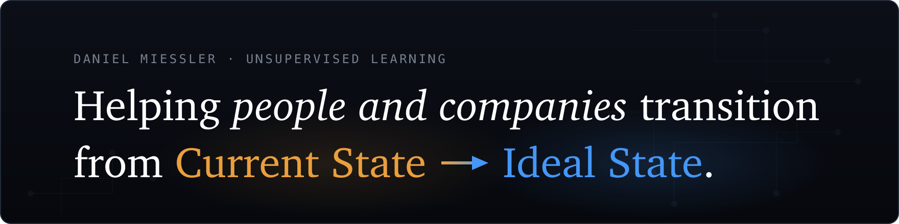
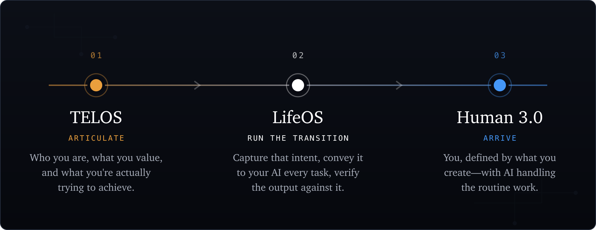

**[Stack](#the-rest-of-the-stack)&nbsp;·&nbsp;[Idea Sites](#idea-sites)&nbsp;·&nbsp;[Writing](#writing)&nbsp;·&nbsp;[Videos](#latest-videos)&nbsp;·&nbsp;[Connect](#connect)**

 

Everything I make is part of one system, and the system has one purpose: **moving people and companies from their current state to their ideal state.**

Most people's current state was assigned to them—a job title, a place in a hierarchy, an identity built on being useful to an organization. The deeper problem is that their ideal state was assigned too—or they were never even taught to ask what it was.

 

**[TELOS](https://github.com/danielmiessler/Telos)**&nbsp;·&nbsp;**[LifeOS](https://github.com/danielmiessler/LifeOS)**&nbsp;·&nbsp;**[Human 3.0](https://human3.ai)**

**[LifeOS](https://github.com/danielmiessler/LifeOS)** is the main thing I'm building: the AI harness that runs that transition—an intent engineering platform that captures what you ultimately want and conveys it to your AI on every task. *(Formerly PAI.)* 

 

## The Rest of the Stack

**[Fabric](https://github.com/danielmiessler/fabric)**   
An open-source framework for augmenting humans using AI—crowdsourced prompts to extract wisdom, analyze security, summarize content, and hundreds more.

**[Daemon](https://github.com/danielmiessler/Daemon)**   
An open-source personal API framework, from the Universal Daemonization idea in my 2016 book: everything—including people—broadcasts an API that AI assistants can read and act on. Mine is live at [daemon.danielmiessler.com](https://daemon.danielmiessler.com).

**[Substrate](https://github.com/danielmiessler/Substrate)**   
The deeper foundation—a framework for understanding what humans are, what we want, and what progress actually means.

**[TheAlgorithm](https://github.com/danielmiessler/TheAlgorithm)**   
A general problem-solving algorithm built on verifiable Ideal State Criteria.

**[SecLists](https://github.com/danielmiessler/SecLists)**   
The security tester's companion—wordlists and payloads.

<strong>More projects</strong> (earlier and experimental work)

 

| Project | What It Does |
|---------|--------------|
| **[RobotsDisallowed](https://github.com/danielmiessler/RobotsDisallowed)** | The most interesting robots.txt disallowed directories |
| **[Ladder](https://github.com/danielmiessler/Ladder)** | A system for autonomous creation and optimization *(concept, not active)* |
| **[Frames](https://github.com/danielmiessler/Frames)** | Positive and negative mental frames |
| **[ExtractWisdom](https://github.com/danielmiessler/ExtractWisdom)** | The original extract-wisdom prompt project (now in Fabric) |
| **[yt](https://github.com/danielmiessler/yt)** | Pull transcripts from YouTube |
| **[athi](https://github.com/danielmiessler/athi)** | An AI threat modeling framework for policymakers |
| **[Caparser](https://github.com/danielmiessler/Caparser)** | Find apps sending sensitive data unencrypted |

 

## Idea Sites

Standalone sites, each making one argument or holding one archive.

<table>
<tr>
<td valign="top" width="33%">
<strong><a href="https://samsaid.ai">samsaid.ai</a></strong> 
A neutral archive of what Sam Altman has said  
<strong><a href="https://dariosaid.ai">dariosaid.ai</a></strong> 
A neutral archive of what Dario Amodei has said  
<strong><a href="https://danielsaid.ai">danielsaid.ai</a></strong> 
My own positions, held to the same standard  
<strong><a href="https://eternalquestions.ai">eternalquestions.ai</a></strong> 
The semi-unsolvable questions humanity keeps asking  
<strong><a href="https://therealinternetofthings.ai">therealinternetofthings.ai</a></strong> 
My 2016 book on where IoT was actually headed
</td>
<td valign="top" width="33%">
<strong><a href="https://shouldwecontrolopensource.ai">shouldwecontrolopensource.ai</a></strong> 
A structured debate on controlling open-source AI  
<strong><a href="https://aiunderstands.ai">aiunderstands.ai</a></strong> 
18 mysteries that test whether AI genuinely understands  
<strong><a href="https://defineitintext.ai">defineitintext.ai</a></strong> 
If you can define the work in text, AI can do it  
<strong><a href="https://thevulnequation.ai">thevulnequation.ai</a></strong> 
Interactive economics of vulnerability discovery  
<strong><a href="https://highentropycontent.io">highentropycontent.io</a></strong> 
Why high-entropy content wins  
<strong><a href="https://oursafe.ai">oursafe.ai</a></strong> 
Secure AI For Everyone—a practical AI-safety taxonomy
</td>
<td valign="top" width="33%">
<strong><a href="https://daemon.danielmiessler.com">daemon.danielmiessler.com</a></strong> 
My live personal daemon—my current state and work as an API  
<strong><a href="https://thesurface.ai">thesurface.ai</a></strong> 
An AI-curated intelligence feed  
<strong><a href="https://usdebt.io">usdebt.io</a></strong> 
The US national debt as living data  
<strong><a href="https://vulnerabilitydata.io">vulnerabilitydata.io</a></strong> 
CVE and patch data as a living dataset  
<strong><a href="https://newarkcacrime.org">newarkcacrime.org</a></strong> 
Civic crime intelligence for my hometown
</td>
</tr>
</table>

 

## Writing

Start here—the pieces that carry the current thesis.

[From Prompt Engineering to Intent Engineering](https://danielmiessler.com/blog/intent-engineering)&nbsp;·&nbsp;[I Think AGI Just Happened](https://danielmiessler.com/blog/i-think-agi-just-happened)&nbsp;·&nbsp;[The Three Components of Becoming AI Antifragile](https://danielmiessler.com/blog/becoming-ai-antifragile)&nbsp;·&nbsp;[The Coming Divide: AI-Native or Left Behind](https://danielmiessler.com/blog/ai-native-divide)&nbsp;·&nbsp;[A Unified Theory For How AI Will Affect Jobs](https://danielmiessler.com/blog/unified-theory-ai-jobs)&nbsp;·&nbsp;[The Most Durable Human Value](https://danielmiessler.com/blog/the-most-durable-human-value)

**Latest posts** (auto-updated daily):

<!-- BLOG-POST-LIST:START -->
- [Ilya Explains How LLMs Create a World Model](https://danielmiessler.com/blog/ilya-explains-how-llms-create-a-world-model?utm_source=rss&utm_medium=feed&utm_campaign=website)
- [Creativity vs. Consumption](https://danielmiessler.com/blog/creativity-vs-consumption?utm_source=rss&utm_medium=feed&utm_campaign=website)
- [Where an AI Watermark Can Hide in Plain Text](https://danielmiessler.com/blog/where-watermarks-hide-in-text?utm_source=rss&utm_medium=feed&utm_campaign=website)
- [&quot;Nobody Asked for A.I.&quot; Is a Stupid Argument](https://danielmiessler.com/blog/nobody-asked-for-ai?utm_source=rss&utm_medium=feed&utm_campaign=website)
- [Work Just Became Fun for Millions of People](https://danielmiessler.com/blog/work-just-became-fun?utm_source=rss&utm_medium=feed&utm_campaign=website)
- [Why Aren’t Things Worse?](https://danielmiessler.com/blog/why-arent-things-worse?utm_source=rss&utm_medium=feed&utm_campaign=website)
- [The AI-Native Company](https://danielmiessler.com/blog/the-ai-native-company?utm_source=rss&utm_medium=feed&utm_campaign=website)<!-- BLOG-POST-LIST:END -->

**[→ All 3,000+ essays](https://danielmiessler.com/blog)**

 

## Latest Videos

<!-- YOUTUBE-LIST:START -->
- [A Conversation with Liat Hayun](https://www.youtube.com/watch?v=CVuFGA-pbCY)
- [A Conversation with Nico Waisman](https://www.youtube.com/watch?v=jRWBj2JKPYg)
- [A Conversation With Jeremy Epling](https://www.youtube.com/watch?v=HfNPUkOI0hg)
- [A Conversation with Dan DeCloss](https://www.youtube.com/watch?v=aMTi2U8NZyM)
- [A Conversation With Sarit Tager](https://www.youtube.com/watch?v=5DSQxyjCm-g)<!-- YOUTUBE-LIST:END -->

**[→ Unsupervised Learning on YouTube](https://youtube.com/@unsupervised-learning)**

 

## Connect

[Blog](https://danielmiessler.com)&nbsp;·&nbsp;[Newsletter](https://danielmiessler.com/subscribe)&nbsp;·&nbsp;[YouTube](https://youtube.com/@unsupervised-learning)&nbsp;·&nbsp;[X](https://x.com/danielmiessler)&nbsp;·&nbsp;[LinkedIn](https://linkedin.com/in/danielmiessler)&nbsp;·&nbsp;[Books](https://unsupervised-learning.com/books)&nbsp;·&nbsp;[All Repos](https://github.com/danielmiessler?tab=repositories)

 

